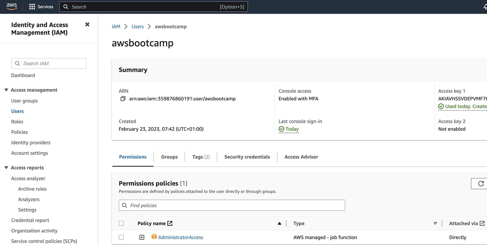

# Week 0 — Billing and Architecture

## Required Homework/Tasks


### Create Conceptual Diagram


[Conceptual Diagram](<https://lucid.app/lucidchart/dbab43b3-5ea2-43d3-87c1-9dd72a63dbde/edit?viewport_loc=-5%2C12%2C2007%2C1076%2CT4Fzp46gac9D&invitationId=inv_55efd418-ef7a-4a31-809f-d70ea9b0ac65>)


### Create Logical Architectural Diagram


[Logical Architectural Diagram](<https://lucid.app/lucidchart/dbab43b3-5ea2-43d3-87c1-9dd72a63dbde/edit?viewport_loc=-5%2C12%2C2007%2C1076%2CT4Fzp46gac9D&invitationId=inv_55efd418-ef7a-4a31-809f-d70ea9b0ac65>)

### Create an Admin User

In my AWS Organization, I created a new AWS account. In the new AWS account, I created a new user called `awsbootcamp` and attached the `AdministratorAccess` policy the user. I also setup multi-factor authentication on both the root and the new admin accounts.


### Generate AWS Credentials

I generated the AWS credentials to access the AWS CLI as seen in the image below.




### Install and Verify AWS CLI

I already have AWS CLI installed on my MacBook. So I had to run the following command to print out the version and bin location.

```
which aws
aws --version
```


I created a new account under my organization and then created a new key pair that I used to configure a new profile for the aws cli as seen below

```
aws configure --profile AWSBootcamp2023
```


```
aws sts get-caller-identity --profile AWSBootcamp2023
```


### Create a Budget

I configure a budget to track spend above the free tier limits and notify me when it exceeds.


### Create CloudWatch Billing Alarm

I created a CloudWatch Billing alarm to notify me when my spending equals or is greater than $5.


